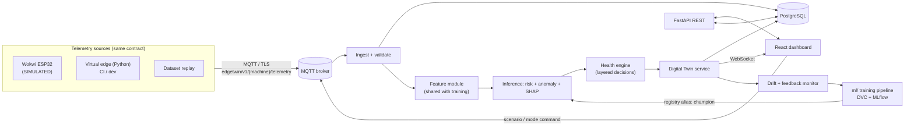

# EdgeTwin AI

**AI-Powered Predictive Maintenance using Digital Twins and Edge Intelligence**

EdgeTwin AI is a predictive-maintenance platform that connects a simulated industrial machine to an edge layer, a telemetry pipeline, ML risk prediction, a Digital Twin state model, a maintenance-decision layer, a live dashboard, and an MLOps lifecycle.

## Architecture Pipeline



## Project Status

| Task ID | Component | Status |
|---|---|---|
| T-001 | Repository hygiene and structure | IN PROGRESS |
| T-002 | Dataset provenance and data card | BLOCKED |
| T-003 | Fix the data pipeline defects | TODO |
| T-004 | Research documents | TODO |
| T-010 | Reproducible data stage (DVC) | TODO |
| T-011 | Shared feature module | TODO |
| T-012 | Model comparison experiment | TODO |
| T-013 | Calibration, threshold, and risk bands | TODO |
| T-014 | Anomaly detector and health score | TODO |
| T-015 | Explainability | TODO |
| T-016 | Registry and model card | TODO |
| T-020 | Telemetry contract v1 | TODO |
| T-021 | Scenario spec and process model | TODO |
| T-022 | Virtual edge (Python) | TODO |
| T-023 | Broker and connectivity setup | TODO |
| T-040 | Feasibility spike (Wokwi) | TODO |
| T-041 | Firmware v1 | TODO |
| T-042 | Firmware v2 | TODO |
| T-043 | Wokwi ↔ backend integration | TODO |
| T-044 | Edge screening (stretch) | TODO |
| T-030 | FastAPI skeleton | TODO |
| T-031 | DB schema + migrations | TODO |
| T-032 | MQTT ingest | TODO |
| T-033 | Inference service | TODO |
| T-034 | Health engine | TODO |
| T-035 | Digital Twin service | TODO |
| T-036 | REST API v1 | TODO |
| T-037 | WebSocket live stream | TODO |
| T-038 | JWT auth + roles | TODO |
| T-050 | Design tokens + component kit | TODO |
| T-051 | App shell, routing | TODO |
| T-052 | Fleet dashboard | TODO |
| T-053 | Machine detail | TODO |
| T-054 | Digital Twin view | TODO |
| T-055 | Predictions + explanations panel | TODO |
| T-056 | Alerts + maintenance workflow | TODO |
| T-057 | History and analytics | TODO |
| T-058 | Model / MLOps page | TODO |
| T-060 | Drift monitor | TODO |
| T-061 | Retrain pipeline | TODO |
| T-062 | GitHub Actions CI | TODO |
| T-063 | docker compose stack | TODO |
| T-070 | End-to-end test | TODO |
| T-071 | Second-dataset pipeline run | TODO |
| T-072 | Demo script | TODO |
| T-073 | Final docs | TODO |

## Setup Instructions

1. Install dependencies: `pip install -e .[dev]`
2. Initialize environment: `cp .env.example .env` (Populate `.env` with actual values)
3. Ensure you have the `edgetwin` virtual environment active for all development work.
4. Set up `pre-commit`: `pre-commit install`

## Local Deployment via Docker Compose (T-063)

EdgeTwin AI includes a multi-container Docker Compose stack for local development and demonstration:

```bash
# 1. Copy environment template
cp .env.example .env

# 2. Build and launch all services in detached mode
docker compose up --build -d

# 3. View live logs
docker compose logs -f

# 4. Stop and preserve volumes
docker compose down
```

### Services & Endpoints

| Service | Container Name | Local Endpoint | Description |
|---|---|---|---|
| **Frontend** | `edgetwin-frontend` | [http://localhost:3000](http://localhost:3000) | React SPA served via Nginx reverse proxy |
| **Backend API** | `edgetwin-api` | [http://localhost:8000](http://localhost:8000) | FastAPI REST service with automated Alembic migrations |
| **API Docs (Swagger)** | `edgetwin-api` | [http://localhost:8000/docs](http://localhost:8000/docs) | Interactive OpenAPI / Swagger UI |
| **PostgreSQL 16** | `edgetwin-postgres` | `localhost:5432` | Relational persistence with named volume `postgres_data` |
| **Mosquitto MQTT** | `edgetwin-mosquitto` | `localhost:1883` | MQTT broker (canonical topic: `edgetwin/v1/{machine_id}/#`) |

### Development Authentication

The backend includes seed credentials for local testing:
- **Admin:** `admin` / `admin123` (`ADMIN` role)
- **Engineer:** `engineer` / `engineer123` (`MAINTENANCE_ENGINEER` role)
- **Operator:** `operator` / `operator123` (`OPERATOR` role)

---

## Continuous Integration (GitHub Actions) (T-062)

The `.github/workflows/ci.yml` pipeline runs on every pull request and push to `main` and `feat/**`:

1. **`backend-quality`**: Python linting (`ruff check .`) and code formatting (`black --check .`).
2. **`firmware-native`**: Host compilation (`g++ -std=c++17`) and execution of native C++ edge firmware unit tests.
3. **`ml-smoke`**: Fast, deterministic verification of serialized model artifacts, 14-feature contract, operational decision threshold ($t^* = 0.160$), risk bands, and model inference without accessing held-out test data.
4. **`frontend-quality`**: Frontend dependency installation (`npm ci`), TypeScript type check (`npm run lint`), Vitest test suite (`npm test -- --run`), and Vite production build (`npm run build`).
5. **`backend-tests`**: Full Pytest suite (unit, contract, integration tests) and simulation verification.
6. **`docker-build`**: Docker Compose configuration validation and multi-container image builds (`edgetwin-api:ci` and `edgetwin-frontend:ci`).
7. **`wokwi-simulation`**: Live Wokwi cloud simulation when `WOKWI_CLI_TOKEN` secret is configured.

---

## Repository Folder Map

- `api/`: Backend service
- `dashboard/`: Frontend UI
- `data/`: Datasets (raw, interim, processed)
- `docs/`: Documentation
- `edge/`: Firmware
- `ml/`: Machine learning pipeline
- `mlops/`: MLOps scripts/configs
- `notebooks/`: Jupyter notebooks
- `simulation/`: Virtual edge and scenario spec
- `tests/`: Test suites

## Note on Data
Existing data is simulated/synthetic or under provenance verification where documented. Held-out test data (`data/test/`) is strictly isolated and never accessed by CI smoke tests or container builds.
