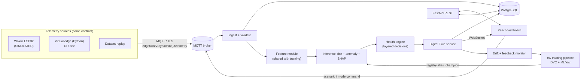

# EdgeTwin AI

**AI-Powered Predictive Maintenance using Digital Twins and Edge Intelligence**

EdgeTwin AI is a predictive-maintenance platform that connects a simulated industrial machine to an edge layer, a telemetry pipeline, ML risk prediction, a Digital Twin state model, a maintenance-decision layer, a live dashboard, and an MLOps lifecycle.

## Architecture Pipeline

## Project Status

| Task ID | Component | Status |
|---|---|---|
| T-001 | Repository hygiene and structure | IN PROGRESS |
| T-002 | Dataset provenance and data card | BLOCKED |
| T-003 | Fix the data pipeline defects | TODO |
| T-004 | Research documents | TODO |
| T-010 | Reproducible data stage (DVC) | TODO |
| T-011 | Shared feature module | TODO |
| T-012 | Model comparison experiment | TODO |
| T-013 | Calibration, threshold, and risk bands | TODO |
| T-014 | Anomaly detector and health score | TODO |
| T-015 | Explainability | TODO |
| T-016 | Registry and model card | TODO |
| T-020 | Telemetry contract v1 | TODO |
| T-021 | Scenario spec and process model | TODO |
| T-022 | Virtual edge (Python) | TODO |
| T-023 | Broker and connectivity setup | TODO |
| T-040 | Feasibility spike (Wokwi) | TODO |
| T-041 | Firmware v1 | TODO |
| T-042 | Firmware v2 | TODO |
| T-043 | Wokwi ↔ backend integration | TODO |
| T-044 | Edge screening (stretch) | TODO |
| T-030 | FastAPI skeleton | TODO |
| T-031 | DB schema + migrations | TODO |
| T-032 | MQTT ingest | TODO |
| T-033 | Inference service | TODO |
| T-034 | Health engine | TODO |
| T-035 | Digital Twin service | TODO |
| T-036 | REST API v1 | TODO |
| T-037 | WebSocket live stream | TODO |
| T-038 | JWT auth + roles | TODO |
| T-050 | Design tokens + component kit | TODO |
| T-051 | App shell, routing | TODO |
| T-052 | Fleet dashboard | TODO |
| T-053 | Machine detail | TODO |
| T-054 | Digital Twin view | TODO |
| T-055 | Predictions + explanations panel | TODO |
| T-056 | Alerts + maintenance workflow | TODO |
| T-057 | History and analytics | TODO |
| T-058 | Model / MLOps page | TODO |
| T-060 | Drift monitor | TODO |
| T-061 | Retrain pipeline | TODO |
| T-062 | GitHub Actions CI | TODO |
| T-063 | docker compose stack | TODO |
| T-070 | End-to-end test | TODO |
| T-071 | Second-dataset pipeline run | TODO |
| T-072 | Demo script | TODO |
| T-073 | Final docs | TODO |

## Setup Instructions

1. Install dependencies: `pip install -e .[dev]`
2. Initialize environment: `cp .env.example .env` (Populate `.env` with actual values)
3. Ensure you have the `edgetwin` virtual environment active for all development work.
4. Set up `pre-commit`: `pre-commit install`

## Repository Folder Map

- `api/`: Backend service
- `dashboard/`: Frontend UI
- `data/`: Datasets (raw, interim, processed)
- `docs/`: Documentation
- `edge/`: Firmware
- `ml/`: Machine learning pipeline
- `mlops/`: MLOps scripts/configs
- `notebooks/`: Jupyter notebooks
- `simulation/`: Virtual edge and scenario spec
- `tests/`: Test suites

## Note on Data
Existing data is simulated/synthetic or under provenance verification where documented.
