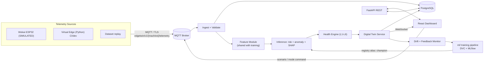

# EdgeTwin AI — Predictive Maintenance Platform

> **AI-Powered Predictive Maintenance using Digital Twins and Edge Intelligence**  
> B.Tech Final Year Project · Mohamed Jameen Ali M R (24AD0173) · Chennai Institute of Technology

[](#github-actions-ci)
[](#testing)
[](#testing)
[](#testing)
[](#testing)
[](LICENSE)

---

## Problem Statement

Unplanned machine downtime is one of the costliest operational problems in manufacturing.
Threshold-only alarm systems are either too late (miss incipient failures) or too noisy
(generate false alarms that operators learn to ignore). Most academic predictive maintenance
(PdM) projects demonstrate an offline ML model but never show how a prediction becomes a
maintenance decision, how the model is governed after deployment, or how the system behaves
when sensors fail or data drifts.

**EdgeTwin AI** addresses the full path — from a sensor reading on a simulated ESP32 device,
through telemetry ingestion, ML inference, Digital Twin state propagation, alert generation,
maintenance workflow, and back to ML governance via a feedback loop — in a single, live,
measurable system.

---

## Why Predictive Maintenance?

| Reactive Maintenance | Preventive Maintenance | **Predictive Maintenance** |
|---|---|---|
| Fix after failure | Fixed-interval overhaul | **Intervene when data says so** |
| Maximum downtime | Unnecessary work | **Optimal cost/risk balance** |
| No data required | Historical schedule | **Live sensor data + ML** |

EdgeTwin AI specifically targets the gap between a working ML model and a working
*system* — demonstrating ingestion, inference, explainability, Digital Twin state,
alert lifecycle, maintenance records, and MLOps governance all in one deployable stack.

---

## Solution: The EdgeTwin AI Platform

EdgeTwin AI connects:

1. **Simulated ESP32 edge device** (Wokwi or virtual Python edge) — reads sensors, runs
   deterministic safety trips, buffers, and publishes over MQTT.
2. **Telemetry ingest pipeline** — validates schema/ranges/duplicates/staleness; stores raw
   telemetry in PostgreSQL with per-signal quality tags.
3. **ML inference pipeline** — XGBoost risk classifier, Platt-calibrated probability,
   Isolation Forest anomaly detector, TreeSHAP feature attributions; shared code with training.
4. **Six-layer health engine** — fuses sensor conditions, ML risk, anomaly score, operational
   rules, and maintenance status into a single machine health score and state.
5. **Digital Twin service** — maintains a live JSON state model per machine (LIVE/STALE/OFFLINE
   sync status, full signal + quality + health + risk + factors + recommendation bundle),
   propagates via WebSocket to the dashboard.
6. **Alert & maintenance workflow** — deduped alerts with severity, lifecycle
   (open → acknowledged → resolved), maintenance work orders, engineer feedback.
7. **MLOps lifecycle** — DVC data versioning, MLflow experiment tracking & model registry,
   live PSI/KS drift monitoring, gated retraining with champion/challenger promotion.
8. **React dashboard** — fleet overview, live telemetry, Digital Twin panel, SHAP explanation,
   alerts, maintenance, history/analytics, MLOps page, scenario control, role-based access.

---

## Architecture



### Decision Layers (separated by design)

| Layer | Question | Output |
|---|---|---|
| L1 Sensor condition | Is each reading trustworthy? | OK / OUT_OF_RANGE / STALE / MISSING / LIMIT_WARN / LIMIT_ALARM |
| L2 ML risk | Failure probability? | p_fail ∈ [0,1], risk band |
| L3 Anomaly | Unlike healthy operation? | score, flag |
| L4 Machine health | Overall state? | score 0–100, HEALTHY/WARNING/CRITICAL/MAINTENANCE_REQUIRED/OFFLINE |
| L5 Alert severity | Who to notify, how urgently? | INFO / WARNING / CRITICAL |
| L6 Recommendation | What to do? | text + action code |

---

## ML Pipeline

```
data/raw (immutable)
  → validate schema (shared)
  → stratified train/val/test split (seeded, stratified)
  → physics feature engineering (Delta_T, Mech_Power, Apparent_Power)
  → train: LR, DT, RF, GBDT(HGB, XGBoost)
  → select on val: PR-AUC, recall@precision
  → calibrate (Platt/Sigmoid) + choose threshold (t* = 0.160)
  → evaluate ONCE on frozen test set
  → MLflow: log params, metrics, SHAP, artifacts
  → register as challenger → gate → champion alias
  → Isolation Forest on healthy rows (unsupervised anomaly)
```

**Production champion:** XGBoost + physics features  
**Feature contract:** 14 features — 10 raw sensors + Machine_Type + Delta_T_C + Apparent_Power_VA + Mech_Power_W  
**Decision threshold:** t* = 0.160 (frozen)  
**Calibration:** Platt/Sigmoid post-hoc  
**Explainability:** TreeSHAP margin attributions

### Held-Out Production Evaluation (S04, frozen test set)

| Metric | Value |
|---|---|
| PR-AUC | 0.923 |
| ROC-AUC | 0.979 |
| Recall | 0.896 |
| Precision | 0.882 |
| F1 | 0.889 |

---

## Digital Twin

Maintains one live JSON state object per machine aligned with ISO 23247 roles:

```json
{
  "machine_id": "MOT-1001",
  "sync": {"status": "LIVE", "last_update": "2026-09-30T...", "staleness_s": 1.2},
  "signals": {"air_temp_c": 25.4, "rpm": 1540, "torque_nm": 41.2, ...},
  "quality": {"vibration_mms": "OK", "pressure_bar": "LIMIT_WARN"},
  "health": {"score": 87.3, "state": "HEALTHY"},
  "risk": {"probability": 0.043, "band": "LOW", "model_version": "edgetwin-risk/2"},
  "anomaly": {"score": 0.12, "flag": false},
  "top_factors": [{"feature": "Torque_Nm", "shap_value": 0.18}, ...],
  "recommendation": "No action required",
  "provenance": "SIMULATED"
}
```

Sync states: **LIVE → STALE** (3× expected interval) **→ OFFLINE** (LWT or timeout).

---

## Edge / IoT Layer

ESP32 firmware (`edge/`) runs independently of the backend:

- Reads sensors (air/process temperature, vibration RMS, load/torque, RPM, pressure, current, voltage, tool wear)
- Computes ΔT, apparent power VA, windowed vibration RMS on-device
- Enforces **deterministic safety limit trips** (thermal, over-current, vibration) that DO NOT depend on the cloud
- Bounded ring buffer for store-and-forward when backend is unreachable
- MQTT publish with last-will + command subscribe (scenario/mode)

Simulated in Wokwi (browser/VS Code ESP32) or via Python virtual edge for CI.

---

## MLOps Lifecycle

```
Live telemetry → Drift monitor (PSI/KS vs training reference)
Live predictions → Feedback (confirmed / false alarm)
Drift OR performance drop → Retrain job (DVC stage)
  → Challenger vs Champion on frozen test + feedback set
  → Gate: Recall ≥ 0.85 AND Precision ≥ 0.70
  → Pass: promote challenger alias → champion
  → Fail: keep champion, log reason
Champion → Rollback: move alias back (one command)
```

**MLflow tracking:** experiment name `edgetwin-production` (AI4I validation: `edgetwin-ai4i-validation`)  
**DVC:** data versioning for raw and interim datasets  
**Drift metrics:** PSI (Population Stability Index), KS (Kolmogorov-Smirnov)

---

## Dashboard Features

| Page | Key Features |
|---|---|
| Fleet Dashboard | Machine cards, health state, risk band, last-seen, alert count |
| Machine Detail | Live telemetry gauges, trend charts, Digital Twin state panel |
| Digital Twin | Live 2D machine schematic bound to twin state, sync status |
| Predictions | Risk timeline, calibrated probability, SHAP bar chart |
| Alerts | Alert table, severity, lifecycle, acknowledge / resolve |
| Maintenance | Work orders, link to alert, status, completed events |
| History & Analytics | Time-series query, aggregated health/prediction history, download |
| MLOps | Model versions, metrics comparison, drift status, retraining history |
| Scenario Control | Inject named fault scenario into simulated machine (Admin/Engineer) |
| Settings | User management, RBAC |

---

## Security & RBAC

| Role | Permissions |
|---|---|
| Admin | Full access: machines, alerts, maintenance, MLOps, scenarios, user management |
| Maintenance Engineer | Read all + acknowledge/resolve alerts, create work orders, submit feedback, inject scenarios |
| Operator | Read-only: fleet overview, machine detail, history |

Security controls: JWT, bcrypt password hashing, role checks server-side in FastAPI
dependencies, CORS allow-list, rate limiting on auth + command endpoints, structured
logging without secrets, non-root Docker container, no Docker socket mounting.

---

## Scenario Simulation

8 canonical scenarios in `simulation/scenarios/`:

| ID | Scenario | Expected Outcome |
|---|---|---|
| SCN-01 | Healthy Nominal Operation | No alerts, health HEALTHY |
| SCN-02 | Heat Dissipation Failure | CRITICAL alert, temp escalation |
| SCN-03 | Overstrain Failure | CRITICAL alert, torque overload |
| SCN-04 | Power Failure + Safety Trip | Hardware safety trip at edge |
| SCN-05 | Tool Wear Degradation | MAINTENANCE_REQUIRED state |
| SCN-06 | Random Vibration Cluster | CRITICAL alert, vibration spike |
| SCN-07 | Sensor Dropout & Quality | Graceful imputation, no false alarm |
| SCN-08 | Machine Offline & LWT | OFFLINE twin state |

---

## Technology Stack

| Layer | Technology |
|---|---|
| Edge firmware | C++17, ESP32, Arduino (Wokwi/native) |
| Simulation | Python 3.11, paho-mqtt |
| Telemetry | MQTT v3.1.1, Eclipse Mosquitto 2.0 |
| Backend | FastAPI, SQLAlchemy 2, Alembic, Pydantic v2 |
| Database | PostgreSQL 16 |
| ML | scikit-learn, XGBoost, SHAP, MLflow, DVC |
| API auth | JWT, bcrypt |
| Frontend | React 18, TypeScript, Vite, Tailwind CSS, Recharts, TanStack Query |
| Testing | pytest, Vitest, g++ native harness |
| CI/CD | GitHub Actions (7 jobs) |
| Containers | Docker, Docker Compose, Nginx |

---

## Repository Structure

```
EdgeTwin-AI/
├── api/                     # FastAPI backend
│   ├── app/
│   │   ├── ingest/          # MQTT consumer, validation, normalizer
│   │   ├── inference/       # ML engine, health engine, SHAP
│   │   ├── twin/            # Digital Twin service + snapshot
│   │   ├── services/        # Alert, maintenance, feedback, history, MLOps
│   │   ├── routes/          # REST API routers
│   │   ├── ws/              # WebSocket broadcaster
│   │   ├── db/              # SQLAlchemy session + base
│   │   ├── models/          # SQLAlchemy ORM models
│   │   ├── schemas/         # Pydantic schemas
│   │   └── security/        # JWT, RBAC, audit
│   └── migrations/          # Alembic migrations
├── dashboard/               # React + TypeScript frontend
│   ├── src/
│   │   ├── pages/           # All page components
│   │   ├── components/      # Shared UI components
│   │   ├── api/             # REST client + WebSocket hook
│   │   ├── hooks/           # useAuth, useTwinWebSocket
│   │   └── types/           # TypeScript interfaces
│   └── tests/               # Vitest test suite
├── ml/                      # ML training pipeline
│   ├── data/                # prepare, features, engineering, schema, splits
│   └── models/              # train, calibrate, evaluate, compare, explain, anomaly, thresholds
├── mlops/                   # MLOps operations
│   ├── drift.py             # PSI/KS drift monitoring
│   ├── feedback_metrics.py  # Feedback-labelled performance
│   ├── retrain.py           # Retraining job
│   ├── promote.py           # Champion/challenger gate
│   └── register.py          # MLflow registration
├── simulation/              # Simulation and virtual edge
│   ├── virtual_edge.py      # Python virtual edge (CI/dev)
│   ├── process_model.py     # Shared physics process model
│   ├── scenarios/           # 8 canonical YAML scenarios
│   └── wokwi_runner.py      # Wokwi CLI integration
├── edge/                    # ESP32 firmware (C++)
│   ├── firmware.ino         # Main sketch
│   ├── process_model.cpp/h  # Physics + safety trips
│   ├── telemetry.cpp/h      # MQTT + JSON formatting
│   ├── ring_buffer.cpp/h    # Bounded store-and-forward
│   ├── command.cpp/h        # Command processor
│   └── sensors.cpp/h        # Sensor drivers (DHT22, MPU6050)
├── tests/
│   ├── api/                 # Backend API tests
│   ├── ml/                  # ML pipeline tests + smoke test
│   ├── mlops/               # MLOps tests
│   ├── integration/         # T-070 benchmark, T-071 AI4I validation
│   ├── contract/            # Telemetry contract tests
│   ├── simulation/          # Scenario + virtual edge tests
│   └── edge/                # Native C++ firmware tests
├── scripts/
│   ├── benchmark_t070.py    # End-to-end latency benchmark
│   ├── benchmark_t071.py    # AI4I 2020 generalization benchmark
│   ├── ml_smoke_test.py     # ML production smoke test runner
│   └── download_ai4i.py     # AI4I dataset fetch helper
├── artifacts/               # Serialized production artifacts
│   ├── calibrated_classifier_sigmoid.joblib
│   ├── champion_features.json
│   ├── anomaly_isolation_forest.joblib
│   ├── anomaly_ref_params.json
│   ├── training_reference_stats.json
│   ├── t070_benchmark_results.json
│   └── t071_ai4i_results.json
├── data/
│   ├── raw/                 # Immutable raw datasets (gitignored CSVs)
│   ├── interim/             # DVC-tracked splits and quality reports
│   └── processed/           # DVC-tracked cleaned/engineered data
├── docs/
│   ├── sessions/            # S01–S30 session reports
│   ├── ml/                  # Model card, calibration, explainability, thresholds
│   ├── api/                 # Telemetry JSON schema
│   ├── wokwi/               # Wokwi integration guide
│   ├── FINAL_EVALUATION_REPORT.md
│   ├── DEMO_RUNBOOK.md
│   └── TROUBLESHOOTING.md
├── mosquitto/               # Mosquitto MQTT broker config
├── .github/workflows/       # GitHub Actions CI (7 jobs)
├── docker-compose.yml       # Full-stack orchestration
├── Dockerfile               # Backend multi-stage image
├── dvc.yaml                 # DVC ML pipeline stages
├── pyproject.toml           # Python project config, ruff/black/pytest
└── README.md                # This file
```

---

## Local Setup (Development)

### Prerequisites

- Python 3.11+
- Node.js 20+
- PostgreSQL 16 (or Docker)
- Eclipse Mosquitto (or Docker)
- g++ (for native firmware tests)

### 1. Clone and install Python dependencies

```bash
git clone https://github.com/your-org/EdgeTwin-AI.git
cd EdgeTwin-AI
pip install -e .
```

### 2. Configure environment

```bash
cp .env.example .env
# Edit .env: set DATABASE_URL, MQTT_*, JWT_SECRET_KEY, etc.
```

### 3. Run database migrations

```bash
alembic -c api/alembic.ini upgrade head
```

### 4. Start MQTT broker

```bash
mosquitto -c mosquitto/mosquitto.conf
```

### 5. Start the backend

```bash
uvicorn api.app.main:app --reload
```

### 6. Start the frontend (dev server)

```bash
cd dashboard
npm install
npm run dev
```

Open: http://localhost:5173

---

## Docker Compose Setup (Recommended)

Runs the full stack (PostgreSQL, Mosquitto, FastAPI, React/Nginx) in containers.

### Prerequisites

- Docker Desktop (running)

### Start

```bash
cp .env.example .env
docker compose up --build -d
```

### Services

| Service | URL | Notes |
|---|---|---|
| Frontend (React) | http://localhost:3000 | Nginx + SPA |
| Backend API | http://localhost:8000 | FastAPI |
| API Docs (Swagger) | http://localhost:8000/docs | OpenAPI |
| PostgreSQL | localhost:5432 | Internal |
| Mosquitto MQTT | localhost:1883 | Internal |

### Default credentials

```
admin / admin_password
engineer / engineer_password
operator / operator_password
```

> ⚠️ Change passwords in `.env` before any shared deployment.

### Stop

```bash
docker compose down
```

---

## API Documentation

Full OpenAPI schema available at http://localhost:8000/docs when running.

### Key Endpoints

| Method | Endpoint | Description |
|---|---|---|
| GET | /api/v1/machines | List all machines |
| GET | /api/v1/machines/{id}/twin | Current Digital Twin state |
| GET | /api/v1/machines/{id}/telemetry | Telemetry history |
| GET | /api/v1/machines/{id}/predictions | Prediction history |
| GET | /api/v1/alerts | All alerts |
| POST | /api/v1/alerts/{id}/acknowledge | Acknowledge alert |
| POST | /api/v1/maintenance | Create work order |
| POST | /api/v1/scenarios | Inject scenario (Admin/Engineer) |
| GET | /api/v1/models/current | Current champion model info |
| GET | /api/v1/models/drift | Drift report |
| POST | /api/v1/auth/login | JWT login |
| GET | /health | Health check |

### WebSocket

`ws://localhost:8000/ws/live` — Twin state + alert broadcasts per machine.

---

## MQTT Topics

| Topic | Direction | Content |
|---|---|---|
| `edgetwin/v1/{machine_id}/telemetry` | Edge → Backend | Sensor telemetry JSON (v1) |
| `edgetwin/v1/{machine_id}/status` | Edge → Backend | Machine status (retained, LWT) |
| `edgetwin/v1/{machine_id}/cmd` | Backend → Edge | Scenario/mode commands |

Telemetry schema: `docs/api/telemetry.v1.schema.json`

---

## Demo Instructions

See [docs/DEMO_RUNBOOK.md](docs/DEMO_RUNBOOK.md) for the full step-by-step demo guide.

**Quick demo flow:**
1. `docker compose up --build -d`
2. Open http://localhost:3000 — login as `admin`
3. Observe fleet dashboard — 6 machines, all HEALTHY
4. Open Machine MOT-1001 → live telemetry + Digital Twin
5. Scenarios → inject "Heat Dissipation Failure"
6. Watch: probability rises → CRITICAL alert → Twin state updates
7. Show SHAP explanation → Acknowledge alert → Create work order
8. Dismiss scenario → machine recovers to HEALTHY
9. MLOps page → drift status, model versions, retraining history

---

## Testing

### Run all tests

```bash
# Backend
pytest -v

# Frontend
cd dashboard && npm test -- --run

# ML smoke test
python scripts/ml_smoke_test.py

# Native firmware
g++ -std=c++17 -O2 -Iedge -Itests/edge -Itests/edge/arduino_compat \
    tests/edge/test_native_edge.cpp edge/process_model.cpp \
    edge/ring_buffer.cpp edge/command.cpp edge/telemetry.cpp \
    -o test_native_edge && ./test_native_edge
```

### Final test counts (T-073 validation)

| Suite | Count | Status |
|---|:---:|:---:|
| Backend pytest | 257+ | ✅ PASS |
| Frontend Vitest | 118 | ✅ PASS |
| Native C++ firmware | 13 | ✅ PASS |
| ML smoke test | 6 | ✅ PASS |
| T-071 AI4I integration | 34 | ✅ PASS |
| **Total** | **428+** | **✅ ALL PASS** |

---

## Benchmark Results

### T-070: End-to-End System Benchmark (S28)

Executed across all 8 canonical scenarios (740 total messages):

| Metric | Value |
|---|---|
| Scenario detection rate | **100.0%** (8/8) |
| False alarm rate (SCN-01) | **0.0%** |
| Ingestion latency (mean) | **11.15 ms** |
| Inference latency (mean) | **49.56 ms** |
| Twin propagation latency (mean) | **3.04 ms** |
| Total pipeline latency (mean) | **60.71 ms** |
| Total pipeline latency (max) | **90.77 ms** |

> Docker runtime: not fully validated on Windows host (daemon unavailable). Compose
> config validated statically. CI runs on ubuntu-latest.

### T-071: AI4I 2020 External Validation (S29)

Applied the frozen production pipeline to the public AI4I 2020 Predictive Maintenance
Dataset (UCI, CC BY 4.0) without retraining.

| Metric | Value | Notes |
|---|---|---|
| ROC-AUC | 0.752 | Meaningful discrimination |
| PR-AUC | 0.285 | vs 0.923 on EdgeTwin test |
| Recall at t*=0.160 | 0.041 | Base-rate mismatch (3.4% vs 11%) |
| Precision at t*=0.160 | 0.933 | 93% TP rate when threshold fires |
| False Alarm Rate | 0.0001 | Near-zero |

6/14 production features are absent in AI4I (Vibration, Pressure, Current, Voltage,
Operating_Hours, Apparent_Power_VA). Performance degradation is fully explained by
feature absence and base-rate mismatch. The production champion is **unmodified**.

---

## Known Limitations

1. **Training data provenance:** Origin of EdgeTwin training dataset is unresolved (T-002 BLOCKED — user has not provided dataset source). A data provenance audit is needed before production use.
2. **Docker daemon on Windows:** Docker Compose config was validated statically; live container testing requires Docker Desktop running. All CI tests run on ubuntu-latest.
3. **Wokwi cloud CLI token:** `WOKWI_CLI_TOKEN` is not configured; Wokwi CI job reports a notice. Native C++ firmware tests pass independently.
4. **Fixed production threshold:** t*=0.160 was optimized for the EdgeTwin training distribution; it would require re-calibration for different sensor suites or base rates.
5. **AI4I feature mismatch:** 43% of production features are absent in AI4I 2020. Results are not comparable to production EdgeTwin performance.
6. **No automatic model promotion:** The gated retraining pipeline is implemented but promotion requires a manual trigger.
7. **No external CMMS integration:** Maintenance work orders are internal-only.
8. **Downsampling in history analytics:** Very long time ranges use downsampled data.
9. **Prediction history dependency:** SHAP explanations depend on persisted inference records.

---

## Future Work

- Resolve T-002 (training data provenance audit)
- Real ESP32 hardware with physical sensors
- Real-time RUL (Remaining Useful Life) prognostics
- TimescaleDB for high-frequency production deployment
- Automatic model promotion with full CI integration
- External CMMS/ERP integration (SAP PM, IBM Maximo)
- Multi-tenant, cloud-deployed variant
- OPC-UA bridge for real plant integration
- Shallow-tree edge screening (on-device inference)
- Evidently AI integration for advanced drift reports

---

## GitHub Actions CI

7-job pipeline triggered on push to `main` and `feat/**`:

| Job | What it validates |
|---|---|
| backend-quality | `ruff check .` + `black --check .` |
| firmware-native | g++ C++17 compilation + 13 unit tests |
| ml-smoke | ML artifact integrity + frozen invariants |
| frontend-quality | TypeScript lint + Vitest 118 tests + Vite build |
| backend-tests | pytest 257+ tests |
| docker-build | `docker compose config` + Buildx images |
| wokwi-simulation | Wokwi cloud emulation or graceful notice |

---

## References & Credits

- Matzka, S. (2020). Explainable Artificial Intelligence for Predictive Maintenance Applications.
  *AI4I 2020 Predictive Maintenance Dataset*, UCI Machine Learning Repository. CC BY 4.0.
- ISO 23247: Digital Twin Framework for Manufacturing (informally referenced for architecture alignment).
- MLflow Aliases (RFC #10336) — used instead of deprecated Stages.
- Wokwi ESP32 Simulator — https://wokwi.com

---

*EdgeTwin AI — B.Tech Final Year Project — Chennai Institute of Technology — 2026*
