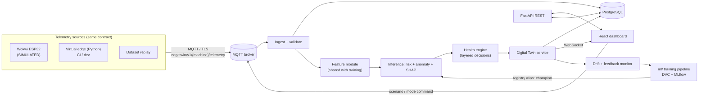
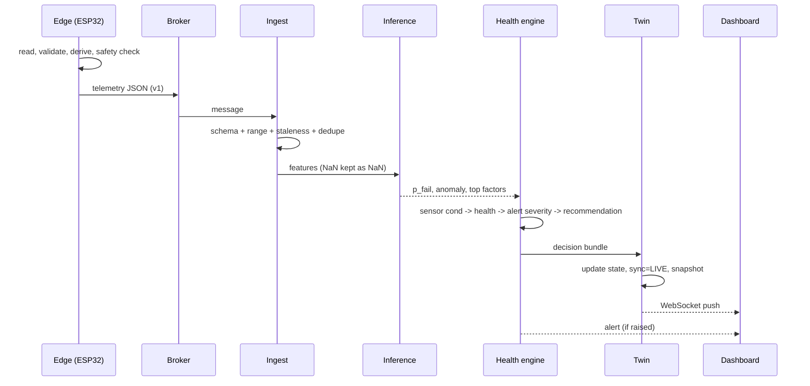
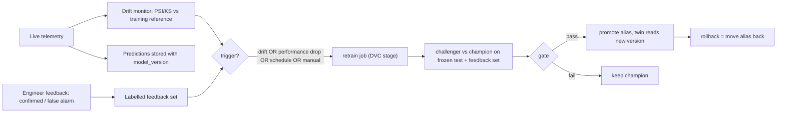
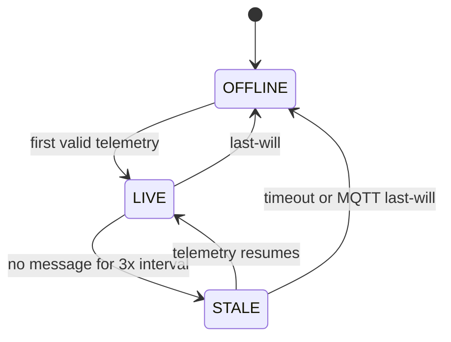
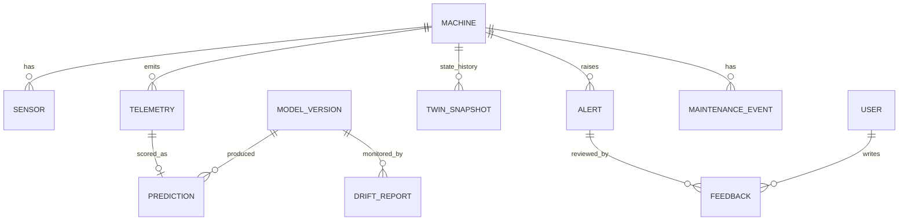
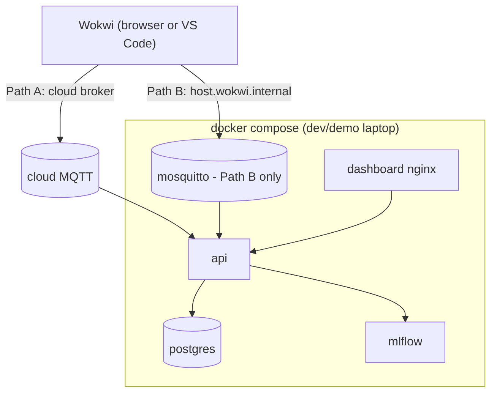

# architecture.md — EdgeTwin AI Architecture

Status: v0.1 DRAFT. Legend: [FACT] sourced · [DECISION] ours · [ASSUMPTION] verify.

## 1. System architecture (one picture)


## 2. Component architecture
| Component | Folder | Responsibility | Talks to |
|---|---|---|---|
| Edge firmware | `edge/` | read/derive/validate, safety trips, buffer, publish, listen for commands | broker |
| Simulation | `simulation/` | scenario spec, process model, virtual edge, dataset replay | broker |
| Backend | `api/` | ingest, inference, health, twin, alerts, REST, WS, auth | broker, DB, MLflow |
| ML | `ml/` | data prep, features, training, eval, explain, registry push | data/, MLflow |
| MLOps | `mlops/` | DVC pipeline, drift jobs, retrain/promotion scripts, CI config | ml/, api/ |
| Frontend | `dashboard/` | UI only; no business logic | api/ |
| Data | `data/` | raw (immutable), interim, processed, reference | — |
| Docs/tests | `docs/`, `tests/` | documentation, unit/integration/e2e | all |

Single backend process (FastAPI + background MQTT consumer) [DECISION]: fewer moving parts for a B.Tech scope; the ingest layer is isolated behind an interface so it can become a worker later.

## 3. Data flow (telemetry → decision)


## 4. Decision layers (kept separate on purpose) [PROPOSED]
| Layer | Question answered | Source | Output |
|---|---|---|---|
| L1 Sensor condition | Can I trust/what does each reading say? | edge + backend rules | per-signal OK / OUT_OF_RANGE / STALE / MISSING / LIMIT_WARN / LIMIT_ALARM |
| L2 ML risk | How likely is a failure condition? | calibrated classifier | p_fail, risk band |
| L3 Anomaly | Is this unlike healthy operation? | Isolation Forest (healthy-only) | score, flag |
| L4 Machine health | Overall state | fusion rule of L1–L3 + trend | score 0–100, state: HEALTHY / WARNING / CRITICAL / MAINTENANCE_REQUIRED / OFFLINE |
| L5 Alert severity | Who must be told, how urgently | rules + hysteresis | INFO / WARNING / CRITICAL |
| L6 Recommendation | What to do | rule table (documented, editable) | text + action code |

Fusion, thresholds, and hysteresis are defined in `docs/ml/health_model.md` (T-034) and are **system recommendations, not industry safety standards**. `MAINTENANCE_REQUIRED` is set by maintenance status/rule (e.g., wear limit or engineer-confirmed), not by ML alone.

## 5. ML pipeline

```mermaid
flowchart LR
  A["data/raw (immutable)"] --> B["validate schema (T-010)"] --> C["split: train/val/test (stratified, seeded)"]
  C --> D["features.py (physics features, NaN-safe)"]
  D --> E["train candidates: LR, DT, RF, GBDT(HGB/XGB)"]
  E --> F["select on validation: PR-AUC, recall@precision"]
  F --> G["calibrate + choose threshold"]
  G --> H["evaluate once on test"]
  H --> I["MLflow: log params, metrics, artifacts, SHAP"]
  I --> J["register version, alias: challenger"]
  J --> K{"gate passed?"}
  K -->|yes| L["alias: champion"]
  K -->|no| M["stay challenger; log reason"]
  D --> N["Isolation Forest on healthy rows"] --> I
```

Leakage rules: `Failure_Type`, `Machine_ID`, `Timestamp`, `Checksum_Flag`, `Sensor_Batch_Code` never features. Imputation (if any) lives inside the sklearn `Pipeline` fit on train only; the champion GBDT uses native NaN handling.

## 6. MLOps lifecycle

Design note [FACT-derived]: a published evaluation found statistically significant feature/prediction drift that did *not* coincide with performance change (arXiv 2211.06239). So drift is a **warning signal**; retraining decisions also require labelled performance evidence. MLflow stages are deprecated in favour of **aliases/tags** (MLflow RFC #10336), so we use aliases `champion` / `challenger`.

## 7. Wokwi + edge architecture
**Verified constraints [FACT]:**
- Wokwi simulates WiFi with full internet access via a gateway; supports MQTT, HTTP/HTTPS, WebSockets. (docs.wokwi.com/guides/esp32-wifi)
- Public gateway: internet only, **no LAN/localhost access**, traffic monitored, do not send private data. Private gateway (local network, `host.wokwi.internal`) requires a **paid** plan on wokwi.com; the **Wokwi for VS Code** extension bundles the private gateway and can expose the simulated serial port over RFC2217. (docs.wokwi.com/vscode/project-config)
- Pricing page: Community = free (public projects, virtual WiFi); Hobby $7/mo lists Private IoT Gateway; VS Code appears under Hobby+ on one page and a "free for open-source, 30-day personal licence" note on the licence page → **[ASSUMPTION] verify current terms before relying on it.**
- Parts available include DHT22, NTC thermistor, DS18B20, MPU6050 (accel/gyro), potentiometers, slide pots, HX711, pushbutton, LEDs, BMP180. **No current/voltage/industrial-pressure sensors.** Wokwi part values come from UI controls; **it does not simulate machine physics.** (docs.wokwi.com/getting-started/supported-hardware)
- Automation scenarios (`set-control`, `wait-serial`) exist but are alpha and need a CLI token; CI minutes are a paid-plan item.

**Two supported connectivity paths [DECISION]:**
| | Path A (default, zero cost) | Path B (preferred if licence works) |
|---|---|---|
| Wokwi | browser, Community plan, public gateway | VS Code extension, bundled private gateway |
| Broker | cloud broker with TLS + credentials (e.g., HiveMQ Cloud Serverless, free tier [limits: verify]) | local Mosquitto in Docker |
| Backend | subscribes to same cloud broker | subscribes to local broker |
| Risk | Community projects are **public** → any credential in the sketch is exposed; traffic passes a monitored gateway | licence terms unverified |
| Mitigation | throw-away, publish/subscribe-limited demo credential, rotate after each demo, TLS on 8883 | project files stay local |

The backend is identical in both paths (only `MQTT_URL/USER/PASS` env vars change).

**Signal mapping (what is a "real" simulated sensor vs modelled):**
| Signal | Source in Wokwi | Note |
|---|---|---|
| Air temperature | DHT22 | interactive slider |
| Process temperature | NTC (or DS18B20) | interactive |
| Vibration (mm/s RMS-like) | MPU6050 accel → windowed RMS on ESP32 | proxy; **not** calibrated velocity |
| Load | slide pot → torque/current model | |
| RPM, pressure, voltage, tool wear, op hours | firmware process model driven by load + scenario | labelled SIMULATED |
Healthy envelope and fault signatures come from EDA of our training data (see docs/dataset/fault_signatures.md), so telemetry is in-distribution by construction, and the fact that it is simulated is explicit in `provenance`.

**Edge vs cloud split [DECISION]**
| At the edge (must work if backend is down) | In the backend (needs data, models, history) |
|---|---|
| range/plausibility checks, sensor-quality flags | schema enforcement, dedupe, persistence |
| ΔT, apparent power, windowed RMS | full feature set, rolling trends |
| deterministic safety limit trips + LED | ML risk, anomaly, SHAP, health fusion |
| bounded buffer + reconnect, last-will | twin state, alerts, recommendations, MLOps |
| (stretch) shallow-tree screening | model versioning, drift, retraining |
Rationale: safety-relevant trips must not depend on connectivity or a model version; heavy/updatable logic stays where it can be versioned and observed. Edge–cloud disagreement is logged as an MLOps signal.

## 8. Telemetry contract v1 (draft)
Topic: `edgetwin/v1/{machine_id}/telemetry` · status (retained, LWT): `.../status` · commands: `.../cmd`.
```json
{"schema":"edgetwin.telemetry.v1","machine_id":"MOT-1001","seq":1842,"ts":"2026-09-24T10:15:03Z",
 "provenance":"SIMULATED","fw":"0.2.0",
 "signals":{"air_temp_c":25.4,"process_temp_c":35.6,"rpm":1540,"torque_nm":41.2,"vibration_mms":2.6,
            "pressure_bar":5.5,"current_a":12.1,"voltage_v":415.2,"tool_wear_min":131.0,"op_hours":10021.5},
 "quality":{"vibration_mms":"OK","pressure_bar":"OK"},
 "edge":{"delta_t_c":10.2,"power_va":5023,"trip":null,"buffered":0}}
```
Missing sensor = `null` (never 0). Full JSON Schema lives in `docs/api/telemetry.v1.schema.json` (T-020).

## 9. Digital Twin architecture
Mapped to ISO 23247 roles [FACT: ISO 23247 defines Observable Manufacturing Element, Device Communication, Digital Twin and User entities]: OME = machine; Device Communication Entity = ESP32 + MQTT; Digital Twin Entity = twin service (state + models + health logic + history); User Entity = dashboard. ISO 23247 is a framework and prescribes no formats [FACT]; we use a JSON state model inspired by the model/instance idea of Azure Digital Twins' DTDL, without adopting DTDL.

Health state machine (independent of sync): HEALTHY ↔ WARNING ↔ CRITICAL, with hysteresis; MAINTENANCE_REQUIRED entered by rule/engineer, exited by a logged maintenance event. Twin = reported state (from telemetry) + derived state (from ML/rules) + maintenance state; provenance is always stored.

## 10. Backend architecture
FastAPI app · `api/ingest` (MQTT consumer, validation) · `api/services` (inference, health, twin, alerts, recommendations) · `api/routers` (REST) · `api/ws` · `api/db` (SQLAlchemy 2, Alembic) · `api/security` · settings via pydantic-settings/env. Services are pure/dependency-injected for testing.

## 11. Frontend architecture
React + TypeScript + Vite + Tailwind; TanStack Query for REST, one WebSocket hook for live state; Recharts for time series; 2D SVG machine schematic bound to twin state. No business logic in the UI.

## 12. Database architecture
PostgreSQL 16 [DECISION]. Telemetry is time-series, but volume here is small (≈ 6 machines × 0.5 Hz ≈ 260k rows/day), so plain PostgreSQL with `(machine_id, ts DESC)` indexes suffices; tables are hypertable-ready if TimescaleDB is ever needed. Avoiding TimescaleDB/MongoDB removes a dependency without losing capability at this scale.

Tables: machines, sensors, telemetry (raw JSON + parsed columns + quality), predictions (p_fail, anomaly, health, factors JSON, model_version, latency), twin_snapshots, alerts, feedback, maintenance_events, model_versions (mirror of registry), drift_reports, users.

## 13. API architecture
REST `/api/v1`: `/machines`, `/machines/{id}/twin`, `/machines/{id}/telemetry?from&to`, `/machines/{id}/predictions`, `/alerts` (+ack/resolve/feedback), `/maintenance`, `/models` (+`/current`, `/drift`), `/scenarios` (POST inject), `/auth/*`, `/health`. WebSocket `/ws/live` (twin updates, alerts). OpenAPI is the contract; errors use a single problem-details shape.

## 14. Deployment architecture

Prometheus/Grafana deliberately **not** included (dashboard already surfaces the operational metrics; add `/metrics` only if time remains).

## 15. Security architecture
Env-var config (`.env` untracked, `.env.example` tracked), GitHub secrets for CI. MQTT: TLS (8883) + per-role credentials; edge credential limited to its topics where the broker supports it [ASSUMPTION for HiveMQ Serverless: verify permission model]; backend validates `machine_id` against payload/topic. API: JWT, bcrypt/argon2 password hashing, role checks in dependencies, pydantic validation, CORS allow-list, rate limiting on auth and command endpoints, structured logs without secrets. Command channel (scenario injection) restricted to Admin/Engineer and simulated machines only. Wokwi public-project exposure handled as in §7.
