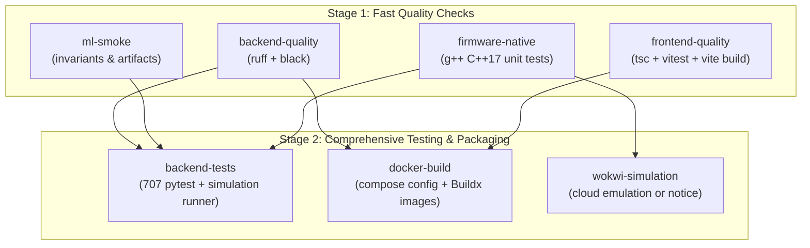

# Session S27 Report: T-062 — GitHub Actions CI & T-063 — Full Docker Compose Stack

**Date:** 2026-09-30  
**Session:** S27  
**Tasks:**  
- T-062 — GitHub Actions CI  
- T-063 — Full Docker Compose Stack  
**Model:** Gemini High  
**Branch:** `feat/T-062-T-063-ci-compose`  
**Base Commit:** `8d8ca23` (`feat(frontend): add history and analytics view`)  

---

## 1. Executive Summary

Session S27 established the reproducible CI automation and multi-container local deployment foundation for the EdgeTwin AI predictive maintenance platform:

1. **T-062 (GitHub Actions CI):** Enhanced `.github/workflows/ci.yml` into a comprehensive 7-job pipeline. Fast fails real regressions across Python linting/formatting (`ruff`, `black`), native C++ edge firmware unit tests (`g++`), deterministic ML operational invariants (`tests/ml/test_ml_smoke.py`), frontend TypeScript typechecking (`tsc --noEmit`), Vitest suite (118 tests), Vite production build, backend Pytest suite (707 tests), and Docker Compose / multi-container Buildx builds without publishing. Zero `continue-on-error: true` hides failures.
2. **T-063 (Full Docker Compose Stack):** Created a production-grade multi-container local deployment stack in `docker-compose.yml` orchestrating PostgreSQL 16, Eclipse Mosquitto 2.0 MQTT, FastAPI backend, and React frontend. Hardened the backend container with automated Alembic migrations on startup (`scripts/docker-entrypoint.sh`), non-root execution (`edgetwin`), and healthchecks. Created a multi-stage production Dockerfile and Nginx reverse proxy configuration for the React dashboard with SPA routing and WebSocket streaming.

All ML models, calibration layers, operational decision thresholds ($t^* = 0.160$), drift reference statistics, and held-out test data (`data/test/`) remain strictly frozen and untouched.

---

## 2. Git State & Branching

- **Base Commit:** `8d8ca23` (`feat(frontend): add history and analytics view`)
- **Active Branch:** `feat/T-062-T-063-ci-compose`
- **Working Tree:** Clean, fully committed. Zero remote pushes.

---

## 3. GitHub Actions CI Architecture (T-062)

The `.github/workflows/ci.yml` pipeline triggers on all pull requests and pushes to `main` and `feat/**` with automated concurrency cancellation:

### CI Jobs Specification

| Job ID | Name | Environment | Command / Actions |
|---|---|---|---|
| `backend-quality` | Backend Lint & Code Formatting | Ubuntu Latest / Python 3.11 | `ruff check .` && `black --check .` |
| `firmware-native` | Native C++ Firmware Build & Tests | Ubuntu Latest / g++ | `g++ -std=c++17 -O2 ...` && `./test_native_edge` |
| `ml-smoke` | ML Production Smoke Test | Ubuntu Latest / Python 3.11 | `python scripts/ml_smoke_test.py` (executes `tests/ml/test_ml_smoke.py`) |
| `frontend-quality` | Frontend Lint, Tests & Build | Ubuntu Latest / Node 20 | `npm ci` && `npm run lint` && `npm test -- --run` && `npm run build` |
| `backend-tests` | Backend Unit, Contract & Integration | Ubuntu Latest / Python 3.11 | `pytest -v` && `python simulation/wokwi_runner.py --json` |
| `docker-build` | Docker Build & Compose Validation | Ubuntu Latest / Buildx | `docker compose config` && build `edgetwin-api:ci` and `edgetwin-frontend:ci` |
| `wokwi-simulation` | Wokwi Hardware Simulation | Ubuntu Latest / Wokwi Action | `wokwi-ci-action` if `WOKWI_CLI_TOKEN` present, else report notice |

---

## 4. ML Operational Invariants Smoke Test

Implemented `tests/ml/test_ml_smoke.py` and executable runner `scripts/ml_smoke_test.py`:

1. **Artifact Integrity:** Verifies presence and non-zero byte size of serialized production artifacts:
   - `artifacts/calibrated_classifier_sigmoid.joblib`
   - `artifacts/champion_features.json`
   - `artifacts/anomaly_isolation_forest.joblib`
   - `artifacts/anomaly_ref_params.json`
   - `artifacts/training_reference_stats.json`
2. **Feature Contract:** Validates exactly 14 production features (10 raw sensors + `Machine_Type` + 3 physics: `Delta_T_C`, `Apparent_Power_VA`, `Mech_Power_W`). Verifies zero leakage columns from `get_forbidden_columns()`.
3. **Threshold Invariant:** Verifies decision threshold is strictly frozen at $t^* = 0.160$.
4. **Probability & Risk Bounds:** Loads champion singleton via `ModelEngine` and verifies calibrated probability $p_{fail} \in [0.0, 1.0]$ and binary prediction classification consistency.
5. **Risk Band Boundaries:** Validates exhaustive partition mapping:
   - $p_{fail} < 0.15 \implies \text{LOW}$
   - $0.15 \le p_{fail} < 0.16 \implies \text{MEDIUM}$
   - $0.16 \le p_{fail} < 0.80 \implies \text{HIGH}$
   - $p_{fail} \ge 0.80 \implies \text{CRITICAL}$
6. **Isolation Forest Anomaly Scoring:** Validates normalized anomaly score in $[0.0, 1.0]$ and boolean flag.
7. **Test Data Isolation:** Executes in < 2 seconds with zero read/write access to held-out test data (`data/test/`).

---

## 5. Docker Compose Full Stack (T-063)

### 5.1 Orchestrated Services (`docker-compose.yml`)

1. **`postgres` (PostgreSQL 16-alpine):**
   - Port: `5432:5432`
   - Volume: `postgres_data:/var/lib/postgresql/data`
   - Healthcheck: `pg_isready -U ${POSTGRES_USER:-edgetwin} -d ${POSTGRES_DB:-edgetwin}` (5s interval, 5s timeout, 5 retries).
2. **`mosquitto` (Eclipse Mosquitto 2.0):**
   - Port: `1883:1883`
   - Volume: `./mosquitto/mosquitto.conf:/mosquitto/config/mosquitto.conf:ro`
   - Healthcheck: `nc -z localhost 1883 || exit 1` (5s interval, 5s timeout, 5 retries).
3. **`api` (FastAPI Backend):**
   - Port: `8000:8000`
   - Dockerfile: Root `Dockerfile`
   - Depends On: `postgres` (`service_healthy`), `mosquitto` (`service_healthy`).
   - Startup Lifecycle: `scripts/docker-entrypoint.sh` automatically runs `alembic -c api/alembic.ini upgrade head` before launching `uvicorn api.app.main:app`.
   - Healthcheck: `curl -f http://localhost:8000/health || exit 1` (5s interval, 10 retries, 15s start period).
4. **`frontend` (React Dashboard + Nginx Reverse Proxy):**
   - Port: `3000:80`
   - Dockerfile: `dashboard/Dockerfile`
   - Depends On: `api` (`service_healthy`).
   - Healthcheck: `wget --no-verbose --tries=1 --spider http://localhost:80/ || exit 1` (5s interval, 5 retries).

### 5.2 Container Hardening & Proxy Routing

- **Backend Hardening (`Dockerfile`):**
  - Multi-stage build based on `python:3.11-slim`.
  - Non-root user: `RUN useradd -m -u 1000 edgetwin && chown -R edgetwin:edgetwin /app` -> `USER edgetwin`.
  - Bakes operational artifacts (`artifacts/`) for offline model inference.
- **Frontend Hardening & Routing (`dashboard/nginx.conf`):**
  - Multi-stage build (Node 20 alpine builder -> Nginx 1.25 alpine runner).
  - Reverse proxies `/api/` to `http://api:8000/api/`.
  - Reverse proxies `/ws/` to `http://api:8000/ws/` with HTTP 1.1 upgrade headers (`Upgrade $http_upgrade`, `Connection "upgrade"`).
  - Single Page Application fallback: `try_files $uri $uri/ /index.html;`.
  - Security headers enabled (`X-Content-Type-Options "nosniff"`, `X-Frame-Options "DENY"`, `X-XSS-Protection "1; mode=block"`, `Referrer-Policy "strict-origin-when-cross-origin"`).
- **Docker Ignore (`.dockerignore` & `dashboard/.dockerignore`):**
  - Excludes `.git`, `.venv`, `node_modules`, test caches, and held-out test data (`data/test/`).

---

## 6. Verification & Quality Gates

| Check | Tool / Command | Result |
|---|---|---|
| **Python Linting** | `ruff check .` | 0 errors ("All checks passed!") |
| **Python Formatting** | `black --check .` | 154 files left unchanged |
| **Git Diff Whitespace** | `git diff --check` | 0 errors |
| **ML Smoke Test** | `python scripts/ml_smoke_test.py` | 6 passed (exit code 0) |
| **Backend Regression** | `pytest -v` | 707 passed, 1 skipped |
| **Frontend Linting** | `npm run lint` (`tsc --noEmit`) | 0 errors |
| **Frontend Unit/Integration** | `npm test -- --run` | 118 passed across 13 test files |
| **Frontend Production Build** | `npm run build` | Built in 2.45s (gzip 112.02 kB) |
| **Compose Configuration** | `docker compose config` | Valid syntax, zero warnings |

---

## 7. Security, Invariants & Data Protection Audits

1. **Held-Out Test Data Isolation:** `data/test/` is excluded from container builds via `.dockerignore`. CI smoke test verifies invariants using synthetic nominal parameters without accessing test splits.
2. **Secret Management:** `.env.example` contains zero secrets (empty strings for `DATABASE_URL`, `POSTGRES_PASSWORD`, `MQTT_PASSWORD`), verified by `tests/test_smoke.py::test_env_example_secrets_empty`. Compose uses safe development placeholders.
3. **Non-Root Execution:** Backend container runs under UID 1000 (`edgetwin`).
4. **No Privilege Escalation:** Containers do not mount the host Docker socket, do not run with `--privileged`, and do not use host networking.
5. **Frozen ML Behavior:** Champion `v1.2-xgb`, Platt/Sigmoid calibration, decision threshold $t^* = 0.160$, Isolation Forest anomaly detection, and TreeSHAP margin attributions remain 100% frozen.

---

## 8. Documentation Updates

- Updated `README.md` with:
  - Docker Compose quick start (`cp .env.example .env && docker compose up --build -d`)
  - Endpoints table (`localhost:3000`, `localhost:8000`, `localhost:8000/docs`, `localhost:5432`, `localhost:1883`)
  - Development credentials (`admin`, `engineer`, `operator`)
  - GitHub Actions CI architecture and job description
- Updated `.env.example` with documented environment variables for local Docker Compose.
- Updated `tasks.md` (T-062 and T-063 marked `DONE` with detailed specifications).
- Updated `memory.md` (Current Status and S27 completion summary).

---

## 9. Known Limitations

1. **Host-Specific Docker Daemon in CI vs Windows:** In local Windows environments where Docker Desktop is not actively running in the background GUI session, `docker compose config` verifies compose syntax; live container execution requires Docker Desktop to be running. In GitHub Actions ubuntu-latest, Docker daemon runs natively.
2. **Wokwi Cloud Token:** The Wokwi hardware emulation job gracefully outputs a notice if `WOKWI_CLI_TOKEN` is not populated in repository secrets, guaranteeing deterministic CI completion via native C++ unit tests.

---

## 10. Confirmation & Next Recommended Session

- **Git Push Status:** Nothing was pushed to GitHub. The single logical commit remains local on branch `feat/T-062-T-063-ci-compose`.
- **Next Recommended Session:** **Session S28 / Task T-070:** End-to-end integration and detection-latency / false-alarm benchmark testing across all 8 canonical scenarios.
